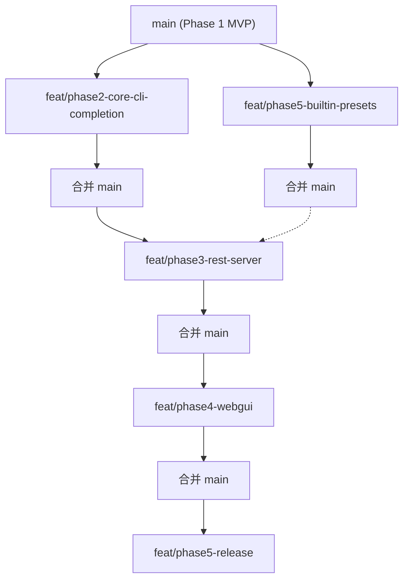

# oc-switch 分支开发策略

> 基于 `2026-06-23-oc-switch-complete-development-plan.md` 与 `2026-06-23-oc-switch-core-cli-mvp.md` 整理。

---

## 一、分支命名约定

```
feat/phase{N}-{kebab-case-description}
```

- 前缀 `feat/`，阶段号 `phase{N}`，短横线描述
- 从 `main` 拉出；有依赖则从上游阶段合并后的 `main` 再拉
- 每阶段完成后尽早合入 `main`，避免 big-bang 合并

---

## 二、有序分支列表

| 顺序 | 分支 | 基线 | 任务 | 依赖 | 状态 |
|------|------|------|------|------|------|
| 1 | `feat/phase2-core-cli-completion` | `main` | 2.1→2.2→2.3→2.4 | 无 | **已合并 main** |
| 2 | `feat/phase5-builtin-presets` | `main` | 5.1 | 无（可与 Phase 2 并行） | **已合并 main** |
| 3 | `feat/phase3-rest-server` | Phase 2 后的 `main` | 3.1→3.2→3.3 | Phase 2 | **已合并 main** |
| 4 | `feat/phase4-webgui` | Phase 3 后的 `main` | 4.1→4.4 | Phase 3 | **已合并 main** |
| 5 | `feat/phase5-release` | Phase 4 后的 `main` | 5.2→5.3 | Phase 4 | **待开工** |

### Phase 2 分支内顺序（共享 `packages/cli/src/index.ts`，不可拆并行）

1. **2.1** — backup list/restore、`diff.ts`、CLI `backup`/`diff`
2. **2.2** — `preset-store.ts`、CLI `presets`/`import`
3. **2.3** — provider/model CRUD 操作与 CLI
4. **2.4** — `provider-sync.ts`、CLI `provider sync`

---

## 三、并行化地图



**可并行：** `feat/phase2-core-cli-completion` ∥ `feat/phase5-builtin-presets`

**须串行：** Phase 3 ← Phase 2；Phase 4 ← Phase 3；Phase 5.2–5.3 ← Phase 4

---

## 四、各分支验证命令

### Phase 2 全量

```bash
bun test && bun run typecheck
```

### Phase 5.1

```bash
bun test packages/core/test/builtin-presets.test.ts
bun test && bun run typecheck
```

### Phase 3 全量

```bash
bun test && bun run typecheck
```

### Phase 4 全量

```bash
bun test && bun run typecheck && bun run --cwd packages/web build
bun run test:e2e
```

### Phase 5.2–5.3

```bash
bun run check
bun run acceptance
OPENCLAW_CONFIG_PATH="$HOME/.openclaw/openclaw.json" bun run packages/cli/src/index.ts status
```

---

## 五、推荐合并顺序

1. `feat/phase2-core-cli-completion` → `main`
2. `feat/phase5-builtin-presets` → `main`（与 1 并行开发，合并先后均可）
3. `feat/phase3-rest-server` → `main`
4. `feat/phase4-webgui` → `main`
5. `feat/phase5-release` → `main`

---

## 六、注意事项

- Phase 2 与 Phase 5.1 并行开发时应使用 **git worktree** 隔离，避免共享工作区冲突
- Phase 2 改动仅限 `packages/core` 读写信令；`packages/cli` 为薄包装
- 各分支完成前须 `bun test` + `bun run typecheck` 全绿
